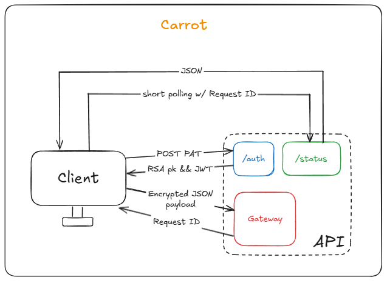

<h1 align="center">Carrot 🥕</h1>

<p align="center">


</p>

<p align="center">
<b>Carrot</b> is a lightweight API designed to securely handle encrypted payloads through a simple authentication and message gateway system. It uses RSA encryption combined with JWT authentication to ensure secure communication between clients and the API.
</p>

<p align="center">

</p>

## Summary

- [Architecture](#Architecture)
- [API Endpoints](#API-Endpoints)
- [Project Structure](#Project-Structure)
- [Running Locally](#Running-Locally)
- [Security Details](#Security-Details)
- [Tech Stack](#Tech-Stack)
- [License](#License)

## Architecture

```Client ↔️ API (Auth | Gateway | Status)```

### Flow Overview

1. The client authenticates using a Personal Access Token (PAT) via `/auth`.
2. The API responds with:
    - RSA Public Key (`RSA pk`)
    - JWT Token (`JWT`)
3. The client encrypts its payload using the RSA public key and sends it to `/gateway` in a specific JSON format.
4. The API returns a `Request ID`.
5. The client checks `/status/{request_id}` with the `Request ID` using short polling to retrieve the final JSON result.

## API Endpoints

### 🔐 Authentication

- Endpoint: `POST /auth`
- Headers: `Authorization: PAT <your_pat>`
- Response:
```json
{
  "jwt": "<jwt_token>",
  "rsa_public_key": "<public_key_pem>"
}
```

### 📤 Submit Payload

- Endpoint: `POST /gateway`
- Headers: `Authorization: Bearer <jwt_token>`
- Request Body:
```json
{
  "payload": "<encrypted_payload_hex_string>"
}
```
- Response:
```json
{
  "request_id": "<uuid>"
}
```

### 🔄 Check Status

- Endpoint: `GET /status/{request_id}`
- - Response example:
```json
{
  "status": "done"
}
```

## Project Structure

```
src/
├── core/        # Core settings and configurations
│   └── config.py
├── models/      # Pydantic models for request/response payloads
│   └── payload.py
├── routes/      # FastAPI route handlers
│   ├── auth.py
│   ├── gateway.py
│   └── status.py
├── utils/       # Utilities like RSA key management
│   └── keys.py
├── carrot.py    # Main FastAPI application
tests/           # Unit tests with pytest
```

## Running Locally

### Install dependencies:

```bash
pip install -r requirements.txt
```

### Run the API:

```bash
uvicorn src.carrot:app --reload
```

API will be available at:

`http://127.0.0.1:8000`

### Run tests:

```bash
pytest
```

## Security Details

- ✅ Authentication via PAT (`Authorization: PAT <your_pat>`)
- ✅ JWT token issued after authentication
- ✅ Payloads are encrypted using the provided RSA public key (PEM format)
- ✅ The payload format must be JSON with a `"payload"` key, whose value is the encrypted payload encoded as a hexadecimal string

## Tech Stack

- FastAPI — Web framework
- Cryptography — RSA encryption
- PyJWT — JWT authentication
- Pytest — Testing framework

## License

This project is licensed under the MIT License. See the <a href="./LICENSE">LICENSE</a> file for details.

